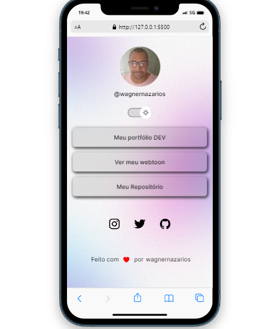

<h1  align="center"> NazarioLinks </h1>

Projeto que desenvolvi durante o curso da <a  href="https://lp.rocketseat.com.br/devlinks/inscricao?utm_source=github&utm_medium=descricao&utm_campaign=capture-devlinks&utm_term=organic&utm_content=descricao-github-mayk-brito">Rocketseat.</a>

 

## 🚀 Tecnologias

Esse projeto foi desenvolvido com as seguintes tecnologias:

  

- HTML e CSS

- JavaScript

- Git e Github

- Figma

  

## 💻 Projeto

  

O NazarioLinks é um agregador de links para que eu possa usar como cartão de visitas online.

  

- [Acesse o projeto finalizado, online](https://wagnernazarios.github.io/WagnerLinks)

  

## 🔖 Layout

  

Você pode visualizar o layout do projeto através [DESSE LINK](https://www.figma.com/community/file/1187422022288947321). É necessário ter conta no [Figma](https://figma.com) para acessá-lo.

  

## :memo: Licença

  

Esse projeto está sob a licença MIT.

  

---

  

Feito com ♥ by wagnernazarios:wave: